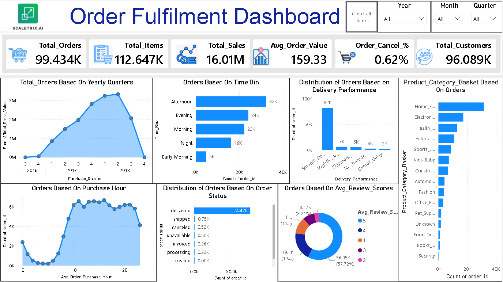
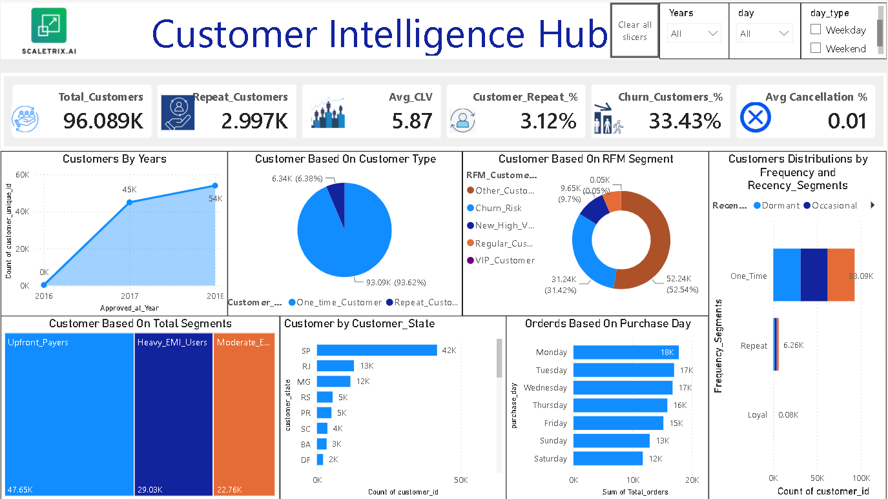

# 🛒 E-Commerce Analytics & Predictive Insights Hub

## 📌 Project Overview

The E-Commerce Analytics & Predictive Insights Hub is an end-to-end analytics solution developed using Python, Streamlit, Power BI, and Machine Learning. The project focuses on analyzing customer behavior, delivery performance, customer satisfaction, and order trends to generate actionable business insights and support data-driven decision-making.

---

## 🎯 Business Objectives

* Reduce Customer Response Time
* Improve Delivery Performance
* Enhance Customer Satisfaction
* Minimize Order Cancellations
* Increase Repeat Customer Rate
* Enable Data-Driven Decision Making

---

## 🛠️ Tech Stack

**Programming & Analytics**

* Python
* Pandas
* NumPy

**Visualization**

* Power BI
* Plotly
* Matplotlib
* Seaborn

**Machine Learning**

* Scikit-Learn
* Forecasting Models

**Development & Deployment**

* Streamlit
* Git
* GitHub

---

## 📊 Key Business Insights

### 👥 Customer Retention

* Business is highly dependent on one-time customers.
* Repeat customers are more active in medium-priced product categories.
* Durable products such as furniture and electronics show lower repurchase frequency.

### 💬 Customer Support

* Average customer response time is approximately 2.6 days.
* Response-time outliers indicate opportunities for process improvement.

### ⭐ Customer Satisfaction

* Delivery duration has a noticeable impact on customer ratings.
* Customer satisfaction depends on multiple operational factors beyond pricing.

### 🚚 Delivery Performance

* Shipment-stage delays occur more frequently than final delivery delays.
* Logistics and dispatch operations contribute significantly to fulfillment bottlenecks.

---

## 🤖 Predictive Analytics

Implemented forecasting models to predict future order volumes using historical order data.

**Business Value**

* Better demand forecasting
* Improved inventory planning
* Enhanced operational efficiency
* Data-driven strategic planning

---

## 📷 Dashboard Preview

### Order Fullfilment Dashboard

### Customer Intelligence Hub

### Delivery Performance Dashboard

### Forecasting Dashboard

---

## 🚀 Live Demo

### Streamlit Application

[Add Streamlit Link]

### Power BI Dashboard

[**Power BI Link**](https://app.powerbi.com/view?r=eyJrIjoiYTRjYzA2NjgtMjQ0OS00YTFhLWFkNzktMzU0MjFmYzBlOTg1IiwidCI6IjVlZjZhNGEwLTY4ZGQtNDdjMC04YTU1LWY0NjI1N2EyYzdmMiJ9)

### Project Presentation

[Add PPT/PDF Link]

---

## 🎯 Key Outcomes

✅ Identified customer retention challenges

✅ Analyzed delivery and fulfillment performance

✅ Evaluated customer satisfaction drivers

✅ Built interactive analytics dashboards

✅ Generated business recommendations

✅ Developed machine learning forecasting models

---

## 👩‍💻 Author

**Harshita Sahu**

Aspiring Data Analyst | Data Science Enthusiast

**Skills:** Python, SQL, Power BI, Machine Learning, Data Analytics, Dashboard Development

⭐ If you found this project useful, feel free to explore the dashboards, source code, and project presentation.
